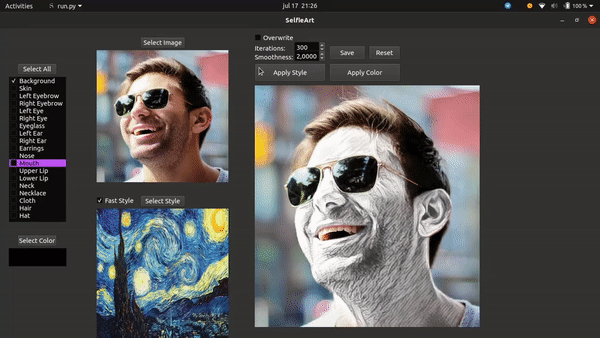

# SelfieArt
SelfieArt: Interactive Multi-Style Transfer for Selfies and Videos with Soft Transitions



## Install

We recommend the use of our conda environment:
```
conda env create -f environment.yml
```

## Run

To run SelfieArt GUI application:
```
python run.py
```

## Acknowledgements

Code for SelfieArt is built on top of:

- [face-parsing.PyTorch](https://github.com/zllrunning/face-parsing.PyTorch)

- [PyTorch-Multi-Style-Transfer](https://github.com/zhanghang1989/PyTorch-Multi-Style-Transfer)

- [Neural Transfer Using PyTorch](https://pytorch.org/tutorials/advanced/neural_style_tutorial.html)


## Citation
```
@InProceedings{AlegreOliveira2020,
  author    = {Alegre, Lucas N. and Oliveira, Manuel M.},
  title     = {SelfieArt: Interactive Multi-Style Transfer for Selfies and Videos with Soft Transitions},
  booktitle = {Proceedings of the 2020 33rd SIBGRAPI Conference on Graphics, Patterns and Images},
  year      = {2020}
}
```

